# MyReader

**MyReader** is an annotation-first reading workspace. Upload a PDF, import a web article, or paste a URL — then set learning objectives, generate an agent-built reading map, highlight passages, and turn selections into structured notes. Every step is traced, exportable, and optionally synced to external knowledge and publishing services.

Formerly **ReadTrace**. The core loop:

```
Workspace → Learning objective → Reading map → Read & highlight → Excerpt cards & notes → Export / publish
```

---

## Architecture

The app is a **Next.js 16** full-stack workspace. The browser talks to API routes; routes orchestrate agents, persist state in **SQLite**, dual-write analytics to **ClickHouse**, and call external LLM and integration APIs when configured.

```mermaid
flowchart TB
    subgraph Client["Browser (React)"]
        Home["Home /objectives"]
        WS["WorkspaceShell<br/>/objectives/:id"]
        PdfReader["PdfReader"]
        MapPanel["ReadingMapPanel"]
        NotesPanel["SidePanelExcerpts"]
        TraceView["AgentTraceView"]
        ExportBtn["ExportMarkdownButton"]
    end

    subgraph API["Next.js API Routes"]
        ObjAPI["/api/objectives"]
        LOAPI["/api/learning-objectives"]
        MapAPI["/api/reading-map/:id"]
        UploadAPI["/api/sources/upload"]
        ImportAPI["/api/sources/import"]
        AnnAPI["/api/annotations"]
        TraceAPI["/api/trace/:id"]
        ExportAPI["/api/objectives/:id/export"]
    end

    subgraph Agents["Agent Layer (src/lib/agents)"]
        ObjAgent["objective-agent"]
        MapAgent["reading-map-agent"]
        DocCtx["document-context"]
        SourceAgent["source-agent"]
        NoteAgent["note-agent"]
        TraceAgent["trace-agent"]
        PublishAgent["publish-agent"]
    end

    subgraph Extract["Document Extraction"]
        PDF["pdf/extract<br/>unpdf"]
        Web["web/scrape<br/>Readability + linkedom"]
        Cache["parsed_doc_cache"]
    end

    subgraph Data["Dual Storage"]
        SQLite[("SQLite<br/>data/myreader.db")]
        CH[("ClickHouse<br/>myreader DB")]
    end

    subgraph Events["Observability"]
        Record["recordEvent"]
        SQLiteEvents["event_logs"]
        CHEvents["reading_events"]
        Lapdog["Datadog Lapdog<br/>dd-trace llmobs"]
    end

    subgraph LLM["LLM Providers"]
        Router["OpenRouter"]
        Gemini["Google Gemini"]
        OpenAI["OpenAI"]
        Nvidia["NVIDIA NIM"]
        Template["Template fallback"]
    end

    subgraph External["Optional Integrations"]
        Semiont["Semiont<br/>W3C annotations"]
        Nimble["Nimble<br/>web search"]
        Senso["Senso<br/>publishing"]
    end

    %% User flows
    Home --> ObjAPI
    WS --> PdfReader & MapPanel & NotesPanel & TraceView & ExportBtn
    PdfReader --> AnnAPI
    MapPanel --> MapAPI & UploadAPI & ImportAPI
    ExportBtn --> ExportAPI
    TraceView --> TraceAPI

    %% API → agents & extraction
    MapAPI --> ObjAgent & MapAgent
    MapAgent --> DocCtx & SourceAgent
    MapAgent --> LLM
    UploadAPI --> PDF --> Cache
    ImportAPI --> Web --> Cache
    AnnAPI --> NoteAgent
    NoteAgent --> LLM
    TraceAPI --> TraceAgent

    %% Cache lookup chain
    Cache --> SQLite
    Cache --> CH

    %% Persistence
    ObjAPI & LOAPI & AnnAPI --> SQLite
    UploadAPI & ImportAPI --> SQLite
    ExportAPI --> SQLite

    %% Events pipeline
    UploadAPI & ImportAPI & MapAPI & AnnAPI --> Record
    Record --> SQLiteEvents
    Record --> CHEvents
    MapAgent & NoteAgent --> Lapdog
    LLM --> Lapdog

    %% External sync
    UploadAPI & ImportAPI --> Semiont
    AnnAPI --> Semiont
    SourceAgent --> Nimble
    PublishAgent --> Senso

    %% LLM routing
    LLM --> Router & Gemini & OpenAI & Nvidia & Template
```



### How the pieces connect

| Layer | Role |
|-------|------|
| **Workspace** | Each reading session is an *objective* (workspace) with a stable `trace_id`. Nested *learning objectives* drive map generation and note scoping. |
| **Ingestion** | PDFs (`.pdf`), plain text (`.txt`, `.md`), and web URLs are extracted into paginated text. Results are cached in SQLite `parsed_doc_cache` and ClickHouse `parsed_doc_cache` (keyed by content hash or canonical URL). |
| **Reading map** | `ReadingMapAgent` parses the user's goal, scores document passages via `document-context`, optionally calls an LLM, and saves a step-by-step path in `reading_paths`. |
| **Reading UI** | `PdfReader` renders extracted text (or embedded PDF), captures text selection, and POSTs highlights to `/api/annotations`. Each highlight creates an annotation, excerpt card, and note in SQLite. |
| **Agents & LLM** | `completeText` / `completeJson` in `src/lib/llm/client.ts` route to OpenRouter, Gemini, OpenAI, or NVIDIA. Without keys, agents use deterministic templates. |
| **Events & trace** | `recordEvent` writes structured JSON to stdout, SQLite `event_logs`, and ClickHouse `reading_events`. The Trace tab and `/objectives/:id/trace` read this audit trail. |
| **Lapdog** | When `DD_LLMOBS_ENABLED=1`, `dd-trace` wraps agent and LLM calls. Sessions are keyed by workspace `trace_id` for local inspection at [lapdog.datadoghq.com](https://lapdog.datadoghq.com). |
| **Export** | `ExportMarkdownButton` calls `/api/objectives/:id/export` to assemble highlights, maps, notes, reflections, and published posts into Markdown files under `data/exports/`. |
| **Semiont** | If `SEMIONT_BASE_URL` is set, sources and highlights sync as W3C Web Annotations. Local mode works fully without Semiont. |

---

## Tech stack

| Category | Technology |
|----------|------------|
| Framework | Next.js 16 (App Router), React 19, TypeScript |
| Styling | Tailwind CSS 4 |
| Local database | SQLite via `better-sqlite3` (`data/myreader.db`) |
| Analytics & doc cache | ClickHouse 24.8 (`@clickhouse/client`, Docker Compose) |
| PDF extraction | `unpdf` |
| Web extraction | `@mozilla/readability`, `linkedom` |
| LLM observability | Datadog Lapdog + `dd-trace` LLM Observability |
| IDs | `nanoid`, `uuid` |

---

## Quick start

```bash
npm install
cp .env.example .env.local   # optional API keys
npm run dev
```

Open **[http://localhost:3001](http://localhost:3001)** (or whatever you set as `PORT` in `.env.local`).

Optional ClickHouse for analytics and cross-session document cache:

```bash
npm run clickhouse:up
```

**Full stack (ClickHouse + Next.js, ordered startup with health checks):**

```bash
npm run dev:all
```

**Full walkthrough:** [docs/GETTING_STARTED.md](docs/GETTING_STARTED.md)

---

## Ports & orchestration

MyReader uses **Docker Compose** for ClickHouse and small Node scripts for port checks — no Kubernetes required for local dev.

| Service | Default port | Env var | Notes |
|---------|-------------|---------|-------|
| Next.js app | 3001 | `PORT`, `APP_URL` | Semiont often uses 3001 too — run only one |
| ClickHouse HTTP | 8123 | `CLICKHOUSE_HTTP_PORT`, `CLICKHOUSE_URL` | `npm run clickhouse:up` |
| ClickHouse native | 9000 | `CLICKHOUSE_NATIVE_PORT` | CLI / native client |
| Lapdog trace agent | 8126 | `LAPDOG_PORT`, `DD_TRACE_AGENT_URL` | Wraps app; does **not** serve HTTP UI |

**Avoid conflicts**

```bash
npm run ports:check          # show what's bound on MyReader ports
npm run ports:clear          # stop everything and free all MyReader ports
npm run dev:free             # free PORT (process tree) then start dev
npm run dev                  # predev hook auto-frees PORT before start
```

**Clear all ports (fix EADDRINUSE)**

If `npm run dev:all` fails with `EADDRINUSE` on 3001, a parent `next dev` process is usually still running and respawning `next-server`:

```bash
npm run ports:clear          # kills app + Lapdog listeners, stops ClickHouse Docker
npm run dev:all              # start fresh
```

`ports:clear` will:
- Kill **all** listeners on **3001** plus their parent `npm`/`next dev` process tree
- Run `lapdog stop` and free **8126**
- Run `docker compose down` for ClickHouse (**8123** / **9000**)

**Recommended startup**

| Goal | Command |
|------|---------|
| App only | `npm run dev` |
| App + ClickHouse | `npm run dev:all` |
| App + Lapdog tracing | `npm run dev:lapdog` |
| Everything | `npm run dev:all:lapdog` |

Lapdog listens on **8126** and wraps the Next.js process on **3001** — they are separate ports by design.

---

### Demo flow (no API keys)

1. **Home** → **Upload a new file** (or open an existing reading)
2. Upload a PDF or import a web URL in the **Map** sidebar tab
3. Add a **learning objective** and click **Generate map**
4. Read in the main panel; select text and **Save highlight**
5. Review **Notes** in the sidebar; open **Trace** for agent activity
6. **Export** Markdown from the workspace header

> **Automatic agent demo:** Fetch Anthropic Research & Engineering blog links — see [Anthropic blog feed agent](#anthropic-blog-feed-agent).

---

## Environment variables

Copy `.env.example` to `.env.local`:

```bash
# Ports (defaults shown — copy to .env.local)
PORT=3001
APP_URL=http://localhost:3001
CLICKHOUSE_HTTP_PORT=8123
CLICKHOUSE_NATIVE_PORT=9000
CLICKHOUSE_URL=http://localhost:8123
LAPDOG_PORT=8126

# LLM — set one provider; OpenRouter preferred when multiple keys exist
LLM_PROVIDER=openrouter          # openrouter | gemini | openai | nvidia
OPENROUTER_API_KEY=
OPENROUTER_MODEL=google/gemini-2.0-flash-001
GEMINI_API_KEY=
GEMINI_MODEL=gemini-2.0-flash
OPENAI_API_KEY=
OPENAI_MODEL=gpt-4o-mini
NVIDIA_API_KEY=
NVIDIA_MODEL=meta/llama-3.1-8b-instruct

APP_URL=http://localhost:3001

# Semiont (optional — leave blank for local-only mode)
SEMIONT_BASE_URL=
SEMIONT_TOKEN=

# Optional integrations
NIMBLE_API_KEY=                  # web source discovery
SENSO_API_KEY=                   # cited post publishing

# ClickHouse (start with npm run clickhouse:up)
CLICKHOUSE_USER=default
CLICKHOUSE_PASSWORD=
CLICKHOUSE_DATABASE=myreader

# PDF guardrails
PDF_MAX_BYTES=52428800           # 50 MB
PDF_MAX_PAGES=500

# Datadog Lapdog (local LLM traces)
DD_LLMOBS_ENABLED=0
DD_LLMOBS_ML_APP=myreader
DD_TRACE_AGENT_URL=http://127.0.0.1:8126   # must match LAPDOG_PORT
DD_ENV=development
DD_SERVICE=myreader
LAPDOG_DASHBOARD_URL=https://lapdog.datadoghq.com
LAPDOG_LOCAL_ID=myreader-local
```

> **Port note:** Defaults are in `.env.example`. Semiont's API often uses 3001 — run only one app on that port.

---

## npm scripts

| Script | Description |
|--------|-------------|
| `npm run dev` | Dev server (`PORT`, default 3001); auto-frees stale Next.js |
| `npm run dev:free` | Kill stale Next.js on `PORT`, then start dev |
| `npm run dev:all` | ClickHouse + health wait + Next.js |
| `npm run dev:all:lapdog` | ClickHouse + Lapdog + traced Next.js |
| `npm run dev:lapdog` | Lapdog-wrapped dev with LLM tracing |
| `npm run ports:check` | List MyReader ports and listening PIDs |
| `npm run ports:clear` | Free all MyReader ports (app, Lapdog, ClickHouse) |
| `npm run build` | Production build |
| `npm run start` | Production server (respects `PORT`) |
| `npm run lint` | ESLint |
| `npm run clickhouse:up` | Start ClickHouse via Docker Compose |
| `npm run clickhouse:down` | Stop ClickHouse |
| `npm run fetch:anthropic` | Fetch Anthropic Research & Engineering blog links |
| `npm run lapdog:start` | Start local Lapdog agent |
| `npm run lapdog:stop` | Stop Lapdog |
| `npm run lapdog:status` | Lapdog status |

---

## Key features

- **Multi-format import** — PDF upload, `.txt`/`.md` files, and web URLs (Readability + arXiv/PDF fallbacks)
- **Learning objectives & reading maps** — Agent-generated, document-aware step-by-step paths tied to uploaded sources
- **Highlight-driven notes** — Selections become annotations, excerpt cards, and atomic notes
- **Dual storage** — SQLite for app state; ClickHouse for event analytics and shared parsed-document cache
- **Full audit trail** — Structured events, Trace UI, JSON logs, optional Lapdog LLM spans
- **Markdown export** — Workspace-scoped or notes-only export to `data/exports/`
- **Optional Semiont sync** — W3C Web Annotations and knowledge-graph context when connected
- **Reflection & publish workflow** — Prompts, synthesis, and Senso cited-post publishing (when configured)
- **Anthropic blog feed agent** — Automatic fetch of Research & Engineering post links (hackathon demo)

---

## Anthropic blog feed agent

**AnthropicFeedAgent** is a cron-friendly automatic agent that fetches the latest post links from Anthropic's [Research](https://www.anthropic.com/research) and [Engineering](https://www.anthropic.com/engineering) blogs. No API keys required — built for the hackathon "automatic agent" demo.

### What it does

- Tries RSS feeds first (`/rss.xml`, `/feed.xml`, etc.); falls back to HTML parsing of listing pages via `linkedom`
- Extracts **title**, **URL**, **source** (`research` | `engineering`), and **published date** when available
- Persists links in SQLite table `anthropic_feed_links` with **dedupe by URL** on re-fetch
- Logs structured JSON to stdout on each run (`agent: AnthropicFeedAgent`)

A typical first run fetches ~35 links (~11 research, ~24 engineering). Re-runs update existing rows instead of duplicating.

### Run the fetch

```bash
npm run fetch:anthropic          # CLI — works without dev server (cron-friendly)

# Or trigger via API when the app is running:
curl -X POST http://localhost:3001/api/agents/fetch-anthropic
```

### View results

| Surface | URL |
|---------|-----|
| **UI** | [/feeds/anthropic](http://localhost:3001/feeds/anthropic) — nav link **Anthropic feed** |
| **JSON** | `GET /api/feeds/anthropic` |
| **Filter** | `GET /api/feeds/anthropic?source=engineering&limit=10` |

The UI page includes a **Run fetch agent** button for live demos.

### Schedule (cron)

```bash
0 */6 * * * cd /path/to/my-reader && npm run fetch:anthropic >> /tmp/anthropic-feed.log 2>&1
```

### Implementation

| Piece | Location |
|-------|----------|
| Agent | `src/lib/agents/anthropic-feed-agent.ts` |
| Storage | SQLite `anthropic_feed_links` in `data/myreader.db` |
| Repository | `src/lib/repository/anthropic-feed.ts` |
| CLI script | `scripts/fetch-anthropic.ts` |
| UI | `src/app/feeds/anthropic/page.tsx` |

---

## Project structure

```
my-reader/
├── src/
│   ├── app/                      # App Router pages & API routes
│   │   ├── page.tsx              # Home — reading list
│   │   ├── objectives/           # Workspace UI, trace, notes, publish
│   │   ├── feeds/anthropic/      # Anthropic blog feed (automatic agent demo)
│   │   ├── reader/[sourceId]/    # Standalone reader route
│   │   └── api/                  # REST endpoints
│   ├── components/
│   │   ├── pdf/                  # PdfReader, HighlightedPageText, upload states
│   │   ├── panels/               # ReadingMapPanel, UploadPanel, WebImportPanel
│   │   ├── side/                 # Objective, excerpts, annotations side panels
│   │   ├── trace/                # AgentTraceView
│   │   └── export/               # ExportMarkdownButton
│   ├── lib/
│   │   ├── agents/               # Reading map, notes, source, trace, publish, anthropic-feed agents
│   │   ├── clickhouse/           # ClickHouse client, events, parsed_doc_cache
│   │   ├── db/                   # SQLite schema & migrations
│   │   ├── export/               # Markdown assembly
│   │   ├── llm/                  # Multi-provider LLM client
│   │   ├── observability/        # Events, Lapdog tracing
│   │   ├── pdf/                  # PDF/text extraction & caching
│   │   ├── repository.ts         # Data access layer
│   │   ├── semiont/              # Semiont HTTP client & W3C annotations
│   │   ├── trace/                # Activity trace helpers
│   │   └── web/                  # Web scraping & Readability
│   └── instrumentation.ts        # dd-trace bootstrap for Lapdog
├── data/                         # SQLite DB, uploads, exports (gitignored)
├── scripts/
│   ├── clickhouse-init.sql       # ClickHouse schema on first boot
│   ├── fetch-anthropic.ts        # Anthropic feed agent CLI
│   └── clickhouse-migrate-to-myreader.sql
├── docker-compose.yml            # ClickHouse 24.8
├── docs/GETTING_STARTED.md       # Extended setup & Semiont guide
└── .env.example
```

### App routes

| Route | Purpose |
|-------|---------|
| `/` | Home — list readings, start new upload |
| `/feeds/anthropic` | Anthropic blog feed (automatic agent demo) |
| `/objectives/new` | Create workspace + initial upload |
| `/objectives/:id` | Main workspace (reader + sidebar) |
| `/objectives/:id/trace` | Full-page agent trace |
| `/objectives/:id/notes` | Notes view |
| `/objectives/:id/sources` | Source management |
| `/objectives/:id/reflection` | Reflection workflow |
| `/objectives/:id/publish` | Publish cited post |
| `/reader/:sourceId` | Standalone document reader |

### API routes

| Method | Route | Purpose |
|--------|-------|---------|
| `GET` | `/api/feeds/anthropic` | List fetched Anthropic blog links |
| `POST` | `/api/agents/fetch-anthropic` | Run Anthropic feed fetch agent |
| `POST` | `/api/objectives` | Create workspace |
| `GET` | `/api/objectives/:id` | Workspace payload (sources, annotations, notes) |
| `GET` | `/api/objectives/:id/export` | Markdown export |
| `POST` | `/api/learning-objectives` | Add learning objective |
| `GET/POST` | `/api/reading-map/:learningObjectiveId` | Get or generate reading map |
| `POST` | `/api/sources/upload` | Upload PDF / text file |
| `POST` | `/api/sources/import` | Import web URL |
| `POST` | `/api/sources/search` | Nimble web search |
| `GET` | `/api/sources/:id` | Source detail with paginated text |
| `GET` | `/api/sources/:id/file` | Serve uploaded PDF binary |
| `POST` | `/api/annotations` | Save highlight + excerpt card + note |
| `POST` | `/api/annotations/:id/generate-card` | LLM-enriched excerpt card |
| `POST` | `/api/reflections/prompts` | Reflection prompts |
| `POST` | `/api/reflections` | Save reflection |
| `POST` | `/api/publish` | Publish cited post |
| `GET` | `/api/trace/:objectiveId` | Trace summary |
| `GET` | `/api/trace/:objectiveId/activity` | Activity timeline |
| `GET` | `/api/events/:objectiveId` | Raw event logs |
| `GET` | `/api/clickhouse/status` | ClickHouse connectivity |
| `GET` | `/api/lapdog/status` | Lapdog agent status |
| `GET` | `/api/semiont/status` | Semiont sync status |

---

## ClickHouse

Start the local instance:

```bash
npm run clickhouse:up
```

Database: **`myreader`** (configured via `CLICKHOUSE_DATABASE`).

| Table | Purpose |
|-------|---------|
| `reading_events` | All agent/reading activity — Trace UI prefers this when connected |
| `parsed_doc_cache` | Extracted PDF/web text shared across sessions (ReplacingMergeTree) |

SQLite remains the primary app store (objectives, sources, highlights, notes). Events and parsed documents are **dual-written** to both stores when ClickHouse is available.

If upgrading from the legacy `readtrace` ClickHouse database:

```bash
# Run against your ClickHouse instance
scripts/clickhouse-migrate-to-myreader.sql
```

### Demo queries

```sql
SELECT event_type, count()
FROM myreader.reading_events
GROUP BY event_type
ORDER BY count() DESC;

SELECT concept, count()
FROM myreader.reading_events
ARRAY JOIN concepts AS concept
GROUP BY concept
ORDER BY count() DESC
LIMIT 20;
```

---

## LLM providers

Set keys in `.env.local`. Provider selection:

1. `LLM_PROVIDER` if set and the matching key exists
2. Otherwise first available: OpenRouter → Gemini → OpenAI → NVIDIA
3. No keys → template-based agent output (header shows `LLM: template`)

All LLM calls flow through `src/lib/llm/client.ts` and are wrapped by Lapdog when enabled.

---

## Datadog Lapdog (local LLM traces)

```bash
brew install datadog/lapdog/lapdog   # once
npm run lapdog:start
npm run dev:lapdog
```

Open [lapdog.datadoghq.com](https://lapdog.datadoghq.com) to inspect prompts, agent spans, latency, and token usage. Sessions map to MyReader workspace `trace_id`.

Forward spans to Datadog LLM Observability:

```bash
DD_API_KEY=... lapdog --forward npm run dev
```

---

## Semiont (optional)

When `SEMIONT_BASE_URL` points to a running [Semiont](https://github.com/The-AI-Alliance/semiont) instance:

| MyReader action | Semiont API |
|-----------------|-------------|
| Import source | `POST /api/resources` |
| Save highlight | `POST /api/resources/:id/annotations` (W3C) |
| Generate note | `POST /api/resources/:id/discover-context` |
| Suggest highlights | `detect-annotations-stream` (SSE) |

Without Semiont, highlights save locally to SQLite. See [docs/GETTING_STARTED.md](docs/GETTING_STARTED.md) for port and connection details.

---

## Sponsor integrations

| Track | Role | Env var |
|-------|------|---------|
| **ClickHouse** | Event analytics + parsed-doc cache | `CLICKHOUSE_*` |
| **Semiont** | W3C Web Annotation sync + AI context | `SEMIONT_BASE_URL` |
| **Nimble** | Web source discovery | `NIMBLE_API_KEY` |
| **Senso** | Grounded cited post publishing | `SENSO_API_KEY` |
| **Datadog Lapdog** | Local LLM/agent observability | `DD_LLMOBS_*` |

---

## Observability summary

| Signal | Destination |
|--------|-------------|
| Structured JSON logs | stdout |
| `trace_id` | Per workspace — ties events and Lapdog sessions |
| `event_logs` | SQLite (always) |
| `reading_events` | ClickHouse (when Docker is running) |
| Agent/LLM spans | Lapdog (when `dev:lapdog`) |
| Audit UI | Workspace Trace tab + `/objectives/:id/trace` |

---

## License

Private project (`"private": true` in `package.json`).
